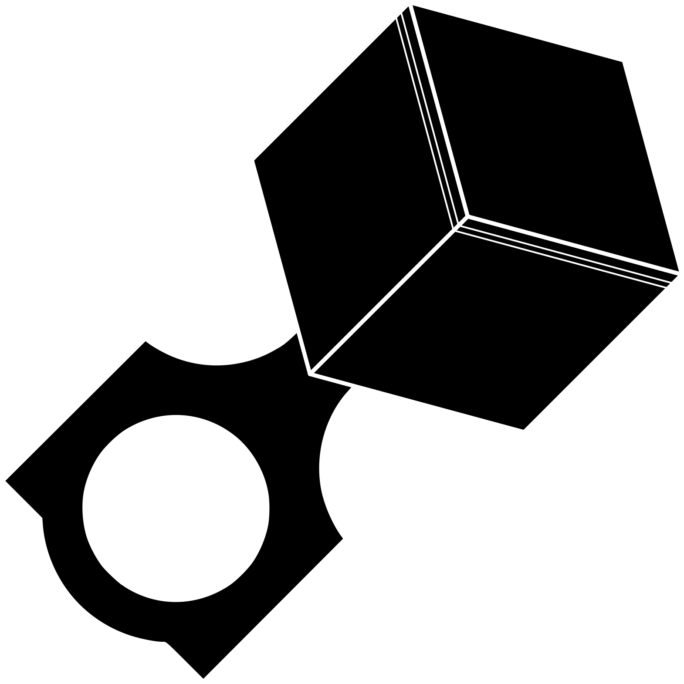

# CubicEngine
A free, source-available voxel game engine written in Rust with Vulkan. Designed to be fast, extensible, and portable across hardware.

---

## 📜 License & Policies

This project is **free to access and free to play**, and will always remain that way. The full source is available under a custom, community-protective license.

Our licensing differs from standard OSI/open-source licenses in order to:

- Protect the rights of artists and modders.
- Enforce community rules against intolerance and monetization.
- Preserve a welcoming and enjoyable ecosystem.

### Core Rules

- 🚫 No intolerance (racism, homophobia, transphobia, misogyny/misandry, etc).
- 🚫 No monetization (gambling, real-world trading, microtransactions, ads, etc).
- 🚫 No harmful or illegal content (pornography, CSAM, etc).
- 🔞 We will **never comply with age verification laws**. As a result, the game may be limited or unavailable in some regions. We make no guarantee of global availability.
- 🔒 We will **never store or share personal information**.
  - Servers may use encrypted client identifiers (IP address or hostname hash) for ban-evasion prevention.
  - Third-party login systems (e.g., Steam) are subject to their own terms.

For details, see:

- [CubicEngine Public License](LICENSE.md)
- [Asset License & Contributor Agreement](ASSETS_LICENSE.md)
- [Trademark & Branding Policy](TRADEMARK.md)
- [Server Code of Conduct](SERVERS.md)
- [Contribution & Modding Guidelines](CONTRIBUTING.md)
- [Project Policy](POLICY.md)

---
